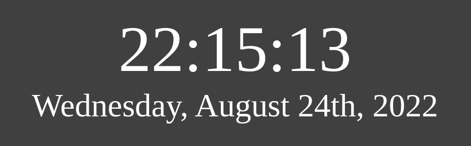

# Digital Clock

_A simple digital clock app. Watch the seconds of your life irreversibly tick away as you admire the simple practicality of this amazing app!_

**Live Preview**: https://et-codes.github.io/clock/

## Description

This app is fairly simple, using vanilla HTML, CSS, and JavaScript. Time is displayed in 24h format in the local time zone, with the day of the week and date displayed below. It makes a great project for learning the basics of writing web applications, and while simple to write and understand, is still quite useful for when you want a large time display on your desktop.
